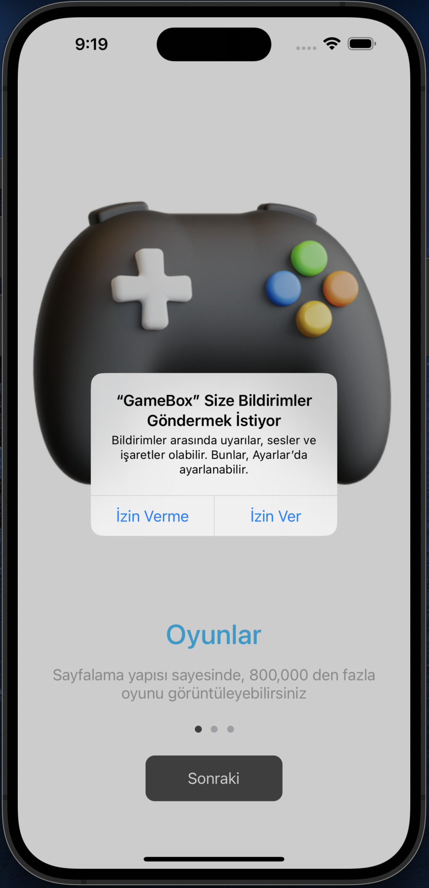
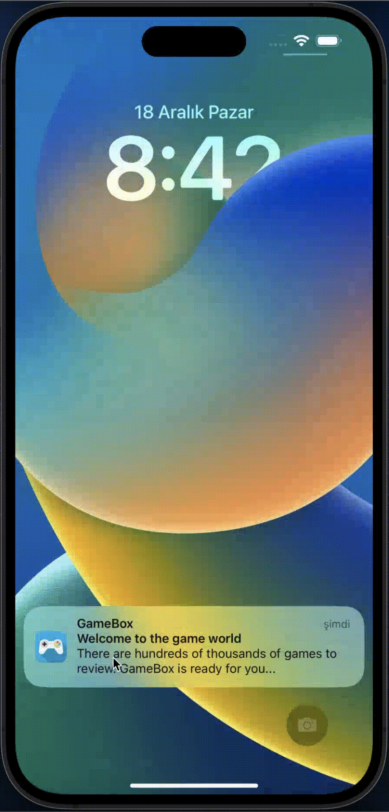
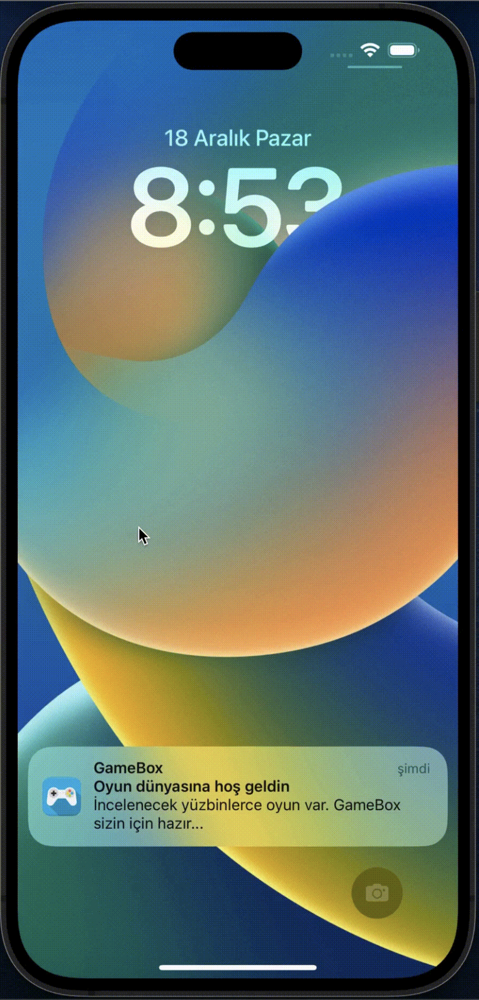

<div align="center">
    <br><br>
    
    <br><br>
    <h1>GameBox</h1>
    <p>
        This repository is the graduation project of the Bootcamp training organized with the cooperation of <a href="https://www.patika.dev/">Patika</a> and <a href="https://www.vakifbank.com.tr/">VakifBank</a>
    </p>
    <hr>
    <div>
        
        
        
        
        <br><br>
        <code>
            This project was developed using XCode version 14.1.0, developed with Swift 5.7 and
            tested on an iPhone 14 Pro Max simulator running iOS 16.1.0
        </code>
    </div>
</div>

<hr>
<br>

<a name="table-of-contents">
    <h1>:notebook_with_decorative_cover: Table of Contents</h1>
</a>
<ul>
    <li>
        <a href="#project-overview">:eyes: Project Overview</a>
    </li>
    <li>
        <a href="#getting-started">:toolbox: Getting Started</a>
    </li>
    <li>
        <a href="#list-of-libraries">:books: List of Libraries</a>
    </li>
    <li>
        <a href="#project-structure">:open_file_folder: Project Structure</a>
    </li>
    <li>
        <a href="#screenshots">:camera_flash: Screenshots</a>
    </li>
    <li>
        <a href="#license">:lock: License</a>
    </li>
</ul>

<hr>

<a name="project-overview">
    <h1>:eyes: Project Overview</h1>
</a>
<p>
This repository consists of the graduation project of the Bootcamp training organized by <a href="https://www.patika.dev/">Patika</a> and <a href="https://www.vakifbank.com.tr/">VakifBank</a> cooperation and the resources related to this project written by <a href="https://github.com/alihankuzucuk">Alihan KUZUCUK</a>
</p>

<hr>

<a name="getting-started">
    <h1>:toolbox: Getting Started</h1>
</a>

<h2>:bangbang: Prerequisites</h2>

> :one: If you don't have any Xcode version on your computer, install from the [Mac App Store](https://apps.apple.com/tr/app/xcode/id497799835?mt=12) lattest version.

> :two: You need to install Cocoapods if you haven't installed it on your computer yet. To do this, run the code below on your Mac:

```ruby
sudo gem install cocoapods
```

<h2>:gear: Installation</h2>

> :one: Clone the current repository in your local by running following command

```ruby
git clone https://github.com/Vakifbank-IOS-Swift-Patika-Bootcamp/final-project-alihankuzucuk.git
```

> :two: Open terminal and change the directory

```ruby
cd final-project-alihankuzucuk/GameBox
```

> :three: To restore pod packages for using dependencies run the following command

```ruby
pod install
```

<h2>:running: Running</h2>

> :one: To run the project with Pods, Open the file with filename <code>.xcworkspace</code> not <code>.xcodeproj</code>

```ruby
open GameBox.xcworkspace
```

> :two: Before running the project, you need to change `API_KEY` variable (which `##API_KEY##` value assigned by default) under <a href="./GameBox/GameBox/App/Constants.swift">Constants.swift</a> file with your API KEY. If you don't have any, you can have one from <a href="https://rawg.io/apidocs">RawG API</a>

<p align="right">(<a href="#table-of-contents">Back to Top</a>)</p>

<hr>

<a name="list-of-libraries">
    <h1>:books: List of Libraries</h1>
</a>
<table>
    <tr>
        <th>Library</th>
        <th>Version</th>
        <th>Description</th>
    </tr>
    <tr>
        <td>
            <a href="https://github.com/Alamofire/Alamofire">Alamofire</a>
        </td>
        <td align="center">Latest</td>
        <td>Alamofire is an HTTP networking library written in Swift</td>
    </tr>
    <tr>
        <td>
            <a href="https://github.com/Alamofire/AlamofireImage">AlamofireImage</a>
        </td>
        <td align="center">~> 4.1</td>
        <td>AlamofireImage is an image component library for Alamofire</td>
    </tr>
    <tr>
        <td>
            <a href="https://github.com/nspavlo/MaterialActivityIndicator">MaterialActivityIndicator</a>
        </td>
        <td align="center">Latest</td>
        <td>MaterialActivityIndicatorView is a drop in replacement for UIActivityIndicatorView</td>
    </tr>
    <tr>
        <td>
            <a href="https://github.com/zvonicek/ImageSlideshow">ImageSlideshow</a>
        </td>
        <td align="center">Latest</td>
        <td>Customizable Swift image slideshow with circular scrolling, timer and full screen viewer</td>
    </tr>
</table>

<p align="right">(<a href="#table-of-contents">Back to Top</a>)</p>

<hr>

<a name="project-structure">
    <h1>:open_file_folder: Project Structure</h1>
</a>
<ul>
    <li>:open_file_folder: <a href="./GameBox/GameBox">GameBox</a></li>
    <ul>
        <li>:open_file_folder: <a href="./GameBox/GameBox/App">App</a></li>
        <kbd>This folder contains App level files</kbd>
        <ul>
            <li>:scroll: <a href="./GameBox/GameBox/App/AppDelegate.swift">AppDelegate.swift</a></li>
            <li>:scroll: <a href="./GameBox/GameBox/App/SceneDelegate.swift">SceneDelegate.swift</a></li>
            <li>:scroll: Main.storyboard</li>
            <li>:scroll: LaunchScreen.storyboard</li>
            <li>:scroll: <a href="./GameBox/GameBox/App/Constants.swift">Constants.swift</a></li>
            <kbd>Contains constant variables that you can use at every level of the application</kbd>
            <li>:scroll: <a href="./GameBox/GameBox/App/Assets.xcassets">Assets.xcassets</a></li>
        </ul>
        <li>:open_file_folder: <a href="./GameBox/GameBox/Core">Core</a></li>
        <kbd>This folder is the core folder of the application. Files that perform basic operations are located in subfolders</kbd>
        <ul>
            <li>:scroll: <a href="./GameBox/GameBox/Core/BaseViewController.swift">BaseViewController.swift</a></li>
            <kbd>A base class that handles base tasks for View Controllers</kbd>
            <li>:open_file_folder: <a href="./GameBox/GameBox/Core/Components">Components</a></li>
            <ul>
                <li>:open_file_folder: <a href="./GameBox/GameBox/Core/Components/FloatingButton">FloatingButton</a></li>
                <ul>
                    <li>:scroll: <a href="./GameBox/GameBox/Core/Components/FloatingButton/FloatingButton.swift">FloatingButton.swift</a></li>
                </ul>
            </ul>
            <li>:open_file_folder: <a href="./GameBox/GameBox/Core/CoreDataManagers">CoreDataManagers</a></li>
            <ul>
                <li>:scroll: <a href="./GameBox/GameBox/Core/CoreDataManagers/GameBoxCoreDataManager.swift">GameBoxCoreDataManager.swift</a></li>
            </ul>
            <li>:open_file_folder: <a href="./GameBox/GameBox/Core/Enums">Enums</a></li>
            <ul>
                <li>:scroll: <a href="./GameBox/GameBox/Core/Enums/NSNotificationNames.swift">NSNotificationNames.swift</a></li>
            </ul>
            <li>:open_file_folder: <a href="./GameBox/GameBox/Core/Extensions">Extensions</a></li>
            <ul>
                <li>:scroll: <a href="./GameBox/GameBox/Core/Extensions/Date+Extension.swift">Date+Extension.swift</a></li>
                <li>:scroll: <a href="./GameBox/GameBox/Core/Extensions/String+Extension.swift">String+Extension.swift</a></li>
                <li>:scroll: <a href="./GameBox/GameBox/Core/Extensions/UIView+Extension.swift">UIView+Extension.swift</a></li>
            </ul>
            <li>:open_file_folder: <a href="./GameBox/GameBox/Core/Network">Network</a></li>
            <kbd>This folder contains the service layers required to connect to internet services</kbd>
            <ul>
                <li>:open_file_folder: <a href="./GameBox/GameBox/Core/Network/RawGService">RawGService</a></li>
                <ul>
                    <li>:open_file_folder: <a href="./GameBox/GameBox/Core/Network/RawGService/ApiModels">ApiModels</a></li>
                    <ul>
                        <li>:scroll: <a href="./GameBox/GameBox/Core/Network/RawGService/ApiModels/BaseResponseModel.swift">BaseResponseModel.swift</a></li>
                    </ul>
                    <li>:scroll: <a href="./GameBox/GameBox/Core/Network/RawGService/RawGClient.swift">RawGClient.swift</a></li>
                </ul>
            </ul>
            <li>:open_file_folder: <a href="./GameBox/GameBox/Core/NotificationManagers">NotificationManagers</a></li>
            <kbd>This folder contains the auxiliary files needed to send user notifications</kbd>
            <ul>
                <li>:scroll: <a href="./GameBox/GameBox/Core/NotificationManagers/LocalNotificationManager.swift">LocalNotificationManager.swift</a></li>
            </ul>
            <li>:open_file_folder: <a href="./GameBox/GameBox/Core/Utilities">Utilities</a></li>
            <kbd>This folder contains auxiliary files that you can use in each layer of the application.</kbd>
            <ul>
                <li>:scroll: <a href="./GameBox/GameBox/Core/Utilities/AppUtility.swift">AppUtility.swift</a></li>
                <li>:scroll: <a href="./GameBox/GameBox/Core/Utilities/AppUtility.swift">ViewUtility.swift</a></li>
                <li>:open_file_folder: <a href="./GameBox/GameBox/Core/Utilities/SceneUtilities">SceneUtilities</a></li>
                <kbd>This folder contains auxiliary files that you can use for scenes</kbd>
                <ul>
                    <li>:open_file_folder: <a href="./GameBox/GameBox/Core/Utilities/SceneUtilities/GameDetail">GameDetail</a></li>
                    <ul>
                        <li>:scroll: <a href="./GameBox/GameBox/Core/Utilities/SceneUtilities/GameDetail/GameDetailSceneUtility.swift">GameDetailSceneUtility.swift</a></li>
                    </ul>
                    <li>:open_file_folder: <a href="./GameBox/GameBox/Core/Utilities/SceneUtilities/GameList">GameList</li>
                    <ul>
                        <li>:scroll: <a href="./GameBox/GameBox/Core/Utilities/SceneUtilities/GameList/GameListSceneUtility.swift">GameListSceneUtility.swift</a></li>
                    </ul>
                </ul>
            </ul>
        </ul>
        <li>:open_file_folder: <a href="./GameBox/GameBox/Scenes">Scenes</a></li>
        <ul>
            <li>:open_file_folder: <a href="./GameBox/GameBox/Scenes/OnBoarding">OnBoarding</a></li>
            <ul>
                <li>:open_file_folder: <a href="./GameBox/GameBox/Scenes/OnBoarding/Model">Model</a></li>
                <ul>
                    <li>:scroll: <a href="./GameBox/GameBox/Scenes/OnBoarding/Model/OnboardingModel.swift">OnboardingModel.swift</a></li>
                </ul>
                <li>:open_file_folder: <a href="./GameBox/GameBox/Scenes/OnBoarding/Controller">Controller</a></li>
                <ul>
                    <li>:scroll: <a href="./GameBox/GameBox/Scenes/OnBoarding/Controller/OnboardingViewController.swift">OnboardingViewController.swift</a></li>
                </ul>
                <li>:open_file_folder: <a href="./GameBox/GameBox/Scenes/OnBoarding/View">View</a></li>
                <ul>
                    <li>:open_file_folder: <a href="./GameBox/GameBox/Scenes/OnBoarding/View/CollectionViewCells">CollectionViewCells</a></li>
                    <ul>
                        <li>:scroll: <a href="./GameBox/GameBox/Scenes/OnBoarding/View/CollectionViewCells/OnboardingCollectionViewCell.swift">OnboardingCollectionViewCell.swift</a></li>
                    </ul>
                </ul>
            </ul>
            <li>:open_file_folder: <a href="./GameBox/GameBox/Scenes/GameList">GameList</a></li>
            <ul>
                <li>:open_file_folder: <a href="./GameBox/GameBox/Scenes/GameList/Model">Model</a></li>
                <ul>
                    <li>:scroll: <a href="./GameBox/GameBox/Scenes/GameList/Model/GameModel.swift">GameModel.swift</a></li>
                </ul>
                <li>:open_file_folder: <a href="./GameBox/GameBox/Scenes/GameList/ViewModel">ViewModel</a></li>
                <ul>
                    <li>:scroll: <a href="./GameBox/GameBox/Scenes/GameList/ViewModel/GameListViewModel.swift">GameListViewModel.swift</a></li>
                </ul>
                <li>:open_file_folder: <a href="./GameBox/GameBox/Scenes/GameList/Controller">Controller</a></li>
                <ul>
                    <li>:scroll: <a href="./GameBox/GameBox/Scenes/GameList/Controller/GameListViewController.swift">GameListViewController.swift</a></li>
                </ul>
                <li>:open_file_folder: <a href="./GameBox/GameBox/Scenes/GameList/View">View</a></li>
                <ul>
                    <li>:open_file_folder: <a href="./GameBox/GameBox/Scenes/GameList/View/TableViewCells">TableViewCells</a></li>
                    <ul>
                        <li>:scroll: <a href="./GameBox/GameBox/Scenes/GameList/View/TableViewCells/GameTableViewCell.swift">GameTableViewCell.swift</a></li>
                        <li>:scroll: GameTableViewCell.xib</li>
                    </ul>
                    <li>:open_file_folder: <a href="./GameBox/GameBox/Scenes/GameList/View/CollectionViewCells">CollectionViewCells</a></li>
                    <ul>
                        <li>:scroll: <a href="./GameBox/GameBox/Scenes/GameList/View/CollectionViewCells/GenreCollectionViewCell.swift">GenreCollectionViewCell.swift</a></li>
                        <li>:scroll: GenreCollectionViewCell.xib</li>
                        <li>:scroll: <a href="./GameBox/GameBox/Scenes/GameList/View/CollectionViewCells/GenreCollectionCardView.swift">GenreCollectionCardView.swift</a></li>
                    </ul>
                </ul>
            </ul>
            <li>:open_file_folder: <a href="./GameBox/GameBox/Scenes/GameDetail">GameDetail</a></li>
            <ul>
                <li>:open_file_folder: <a href="./GameBox/GameBox/Scenes/GameDetail/Controller">Controller</a></li>
                <ul>
                    <li>:scroll: <a href="./GameBox/GameBox/Scenes/GameDetail/Controller/GameDetailViewController.swift">GameDetailViewController.swift</a></li>
                </ul>
            </ul>
            <li>:open_file_folder: <a href="./GameBox/GameBox/Scenes/FavoriteList">FavoriteList</a></li>
            <ul>
                <li>:open_file_folder: <a href="./GameBox/GameBox/Scenes/FavoriteList/Model">Model</a></li>
                <ul>
                    <li>:scroll: <a href="./GameBox/GameBox/Scenes/FavoriteList/Model/FavoriteGameModel.swift">FavoriteGameModel.swift</a></li>
                </ul>
                <li>:open_file_folder: <a href="./GameBox/GameBox/Scenes/FavoriteList/ViewModel">ViewModel</a></li>
                <ul>
                    <li>:scroll: <a href="./GameBox/GameBox/Scenes/FavoriteList/ViewModel/FavoriteListViewModel.swift">FavoriteListViewModel.swift</a></li>
                </ul>
                <li>:open_file_folder: <a href="./GameBox/GameBox/Scenes/FavoriteList/Controller">Controller</a></li>
                <ul>
                    <li>:scroll: <a href="./GameBox/GameBox/Scenes/FavoriteList/Controller/FavoriteListViewController.swift">FavoriteListViewController.swift</a></li>
                </ul>
            </ul>
            <li>:open_file_folder: <a href="./GameBox/GameBox/Scenes/NoteList">NoteList</a></li>
            <ul>
                <li>:open_file_folder: <a href="./GameBox/GameBox/Scenes/NoteList/Model">Model</a></li>
                <ul>
                    <li>:scroll: <a href="./GameBox/GameBox/Scenes/NoteList/Model/NoteModel.swift">NoteModel.swift</a></li>
                </ul>
                <li>:open_file_folder: <a href="./GameBox/GameBox/Scenes/NoteList/ViewModel">ViewModel</a></li>
                <ul>
                    <li>:scroll: <a href="./GameBox/GameBox/Scenes/NoteList/ViewModel/NoteListViewModel.swift">NoteListViewModel.swift</a></li>
                </ul>
                <li>:open_file_folder: <a href="./GameBox/GameBox/Scenes/NoteList/Controller">Controller</a></li>
                <ul>
                    <li>:scroll: <a href="./GameBox/GameBox/Scenes/NoteList/Controller/NoteListViewController.swift">NoteListViewController.swift</a></li>
                </ul>
                <li>:open_file_folder: <a href="./GameBox/GameBox/Scenes/NoteList/View">View</a></li>
                <ul>
                    <li>:scroll: <a href="./GameBox/GameBox/Scenes/NoteList/View/NoteTableViewCell.swift">NoteTableViewCell.swift</a></li>
                    <li>:scroll: NoteTableViewCell.xib</li>
                </ul>
            </ul>
            <li>:open_file_folder: <a href="./GameBox/GameBox/Scenes/AddNote">AddNote</a></li>
            <ul>
                <li>:open_file_folder: <a href="./GameBox/GameBox/Scenes/AddNote/Controller">Controller</a></li>
                <ul>
                    <li>:scroll: <a href="./GameBox/GameBox/Scenes/AddNote/Controller/AddNoteViewController.swift">AddNoteViewController.swift</a></li>
                </ul>
            </ul>
            <li>:open_file_folder: <a href="./GameBox/GameBox/Scenes/NoteDetail">NoteDetail</a></li>
            <ul>
                <li>:open_file_folder: <a href="./GameBox/GameBox/Scenes/NoteDetail/Controller">Controller</a></li>
                <ul>
                    <li>:scroll: <a href="./GameBox/GameBox/Scenes/NoteDetail/Controller/NoteDetailViewController.swift">NoteDetailViewController.swift</a></li>
                </ul>
            </ul>
            <li>:open_file_folder: <a href="./GameBox/GameBox/Scenes/Settings">Settings</a></li>
            <ul>
                <li>:open_file_folder: <a href="./GameBox/GameBox/Scenes/Settings/Controller">Controller</a></li>
                <ul>
                    <li>:scroll: <a href="./GameBox/GameBox/Scenes/Settings/Controller/SettingsViewController.swift">SettingsViewController.swift</a></li>
                </ul>
            </ul>
        </ul>
    </ul>
</ul>

<p align="right">(<a href="#table-of-contents">Back to Top</a>)</p>

<hr>

<a name="screenshots">
    <h1>:camera_flash: Screenshots</h1>
</a>
<div align="center">
    <table>
        <tr>
            <th colspan="2">OnBoarding Scene</th>
        </tr>
        <tr>
            <th colspan="1">OnBoarding Scene In English</th>
            <th colspan="1">OnBoarding Scene In Turkish</th>
        </tr>
        <tr>
            <td colspan="1" align="center">
                </a>
            </td>
            <td colspan="1" align="center">
                </a>
            </td>
        </tr>
        <tr>
            <td colspan="1">You can get information about the app in English if your phone language is English</td>
            <td colspan="1">You can get information about the app in Turkish if your phone language is Turkish</td>
        </tr>
    </table>
</div>
<div align="center">
    <table>
        <tr>
            <th colspan="3">Local Notifications</th>
        </tr>
        <tr>
            <th colspan="1">LocalNotification Request</th>
            <th colspan="1">LocalNotification In English</th>
            <th colspan="1">LocalNotification In Turkish</th>
        </tr>
        <tr>
            <td colspan="1" align="center">
                </a>
            </td>
            <td colspan="1" align="center">
                </a>
            </td>
            <td colspan="1" align="center">
                </a>
            </td>
        </tr>
        <tr>
            <td colspan="1">You can give a permission if you want to see notifications</td>
            <td colspan="1">You can see user notifications in English if your app language is English</td>
            <td colspan="1">You can see user notifications in Turkish if your app language is Turkish</td>
        </tr>
    </table>
</div>

<hr>

<a name="license">
    <h1>:lock: License</h1>
</a>
<p>
    This <a href="">GameBox</a> project is MIT licensed. See the <a href="./LICENSE">LICENSE</a> file for details.
    <br><br>
    <a href="https://github.com/alihankuzucuk">Alihan KUZUCUK</a>
</p>

<p align="right">(<a href="#table-of-contents">Back to Top</a>)</p>
